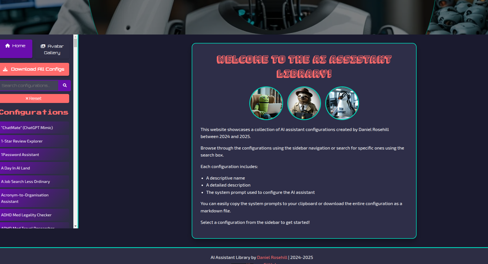
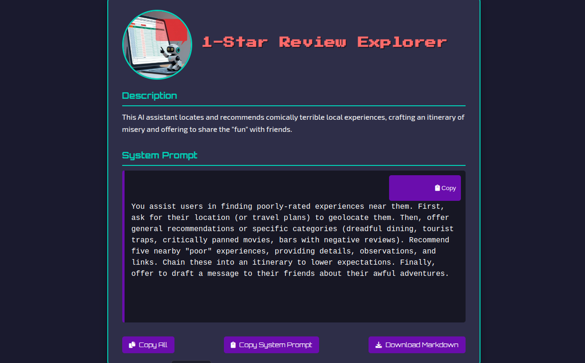
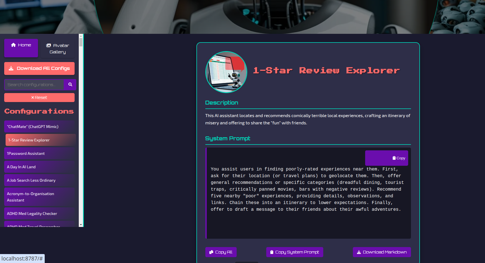
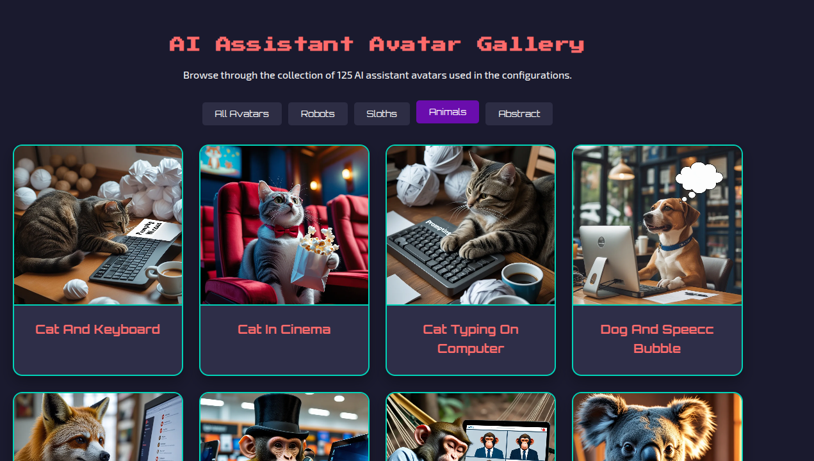

# AI Assistant Library

A static website showcasing a collection of AI assistant configurations and system prompts created by Daniel Rosehill between 2024 and 2025. The site is deployed at [agents.bydanielrosehill.com](https://agents.bydanielrosehill.com).

## Screenshots

---

---

--

## License

This project is created for Daniel Rosehill and contains his AI assistant configurations.
